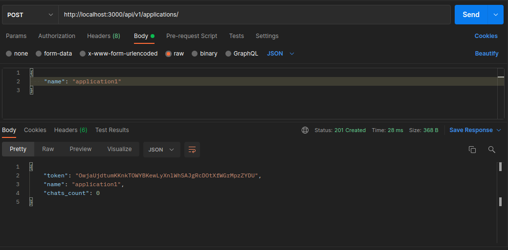
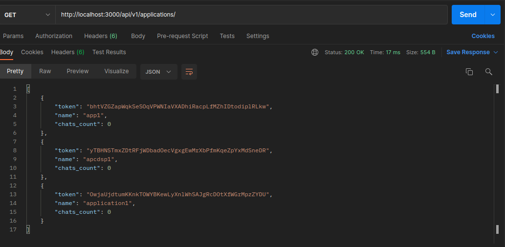
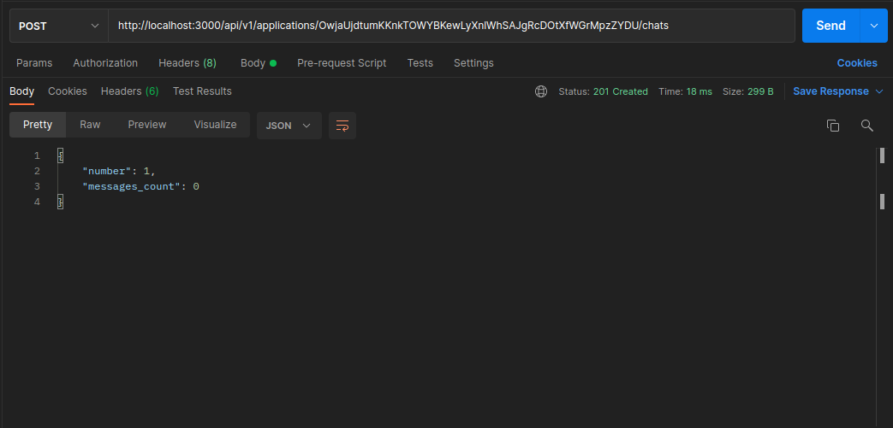
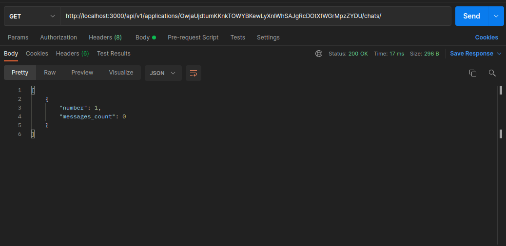
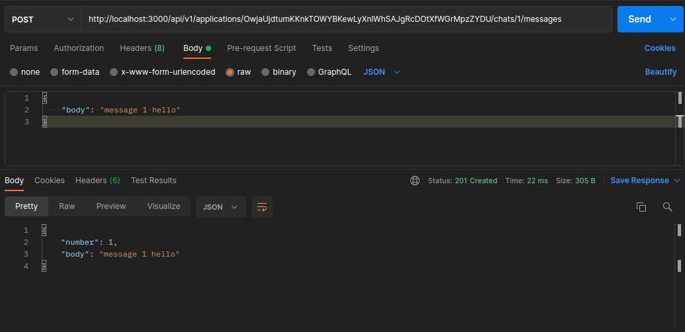
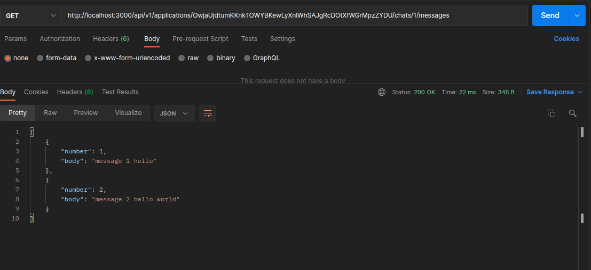
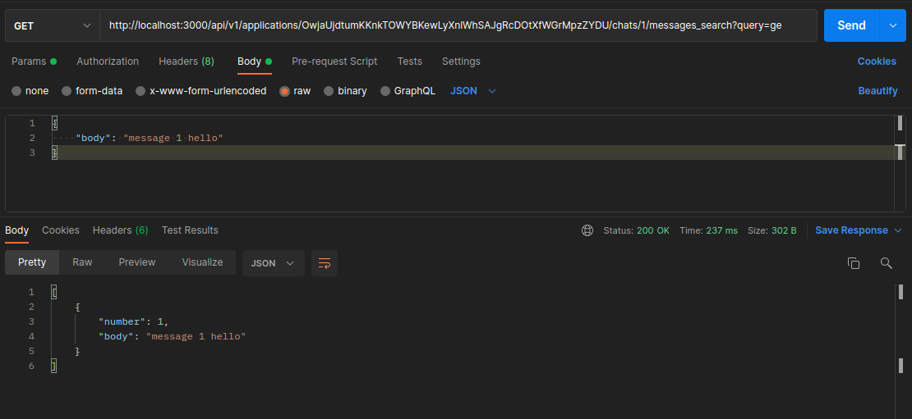
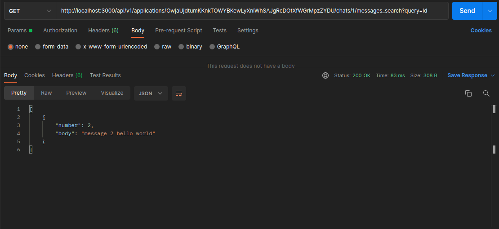

# Instabug Challenge

I applied at Instabug. I recently received this challenge to work on as part of the process.

The callenge is chat system that has multiple Application identified by token, each Application has many chats identified by a number ( number should start from 1) , each Chat has many messages identified by a number ( number should start from 1)
- the endpoints should be RESTful
- Use MySQL as datastore
- use ElasticSearch for searching through messages of a specific chat
- use Docker to contatinerize the application
- use RabbitMQ , Sneakers to avoid race conditions
- Personally I used `rufus-scheduler` to create a cron job to update chats_count and messages_count every 30 minutes

# How To Run The Challenge

We will only write this command to run the whole stack 
``` bash
docker-compose up
``` 

# My Approach
### Understand the requirements
- Extract classes (Application, Chat, Message)
- Define Relations between classes 


### Setup The Docker
- Add (RoR, MySQL, ElasticSearch , Redis , RabbitMQ, Sneakers, RufusScheduler) images
```yml
version: '3.7'
services:
  es01:
    image: docker.elastic.co/elasticsearch/elasticsearch:7.16.3
    container_name: es01
    environment:
      - cluster.name=es-docker-cluster
      - bootstrap.memory_lock=true
      - "ES_JAVA_OPTS=-Xms512m -Xmx512m"
      - discovery.type=single-node
    ulimits:
      memlock:
        soft: -1
        hard: -1
    volumes:
      - data01:/usr/share/elasticsearch/data
    ports:
      - 9200:9200
  db:
    image: mysql:8.0.20
    platform: linux/x86_64
    volumes:
      - mysql:/var/lib/mysql:delegated
    restart: always
    ports:
      - '3307:3306'
    command: --default-authentication-plugin=mysql_native_password
    environment:
      MYSQL_ALLOW_EMPTY_PASSWORD: 1
  redis:
    image: redis:alpine
    restart: always
    ports:
      - '6380:6379'
    volumes:
      - ./volumes/redis-data:/data
    command: redis-server
  rabbitmq:
    image: rabbitmq:3.9-management-alpine
    restart: always
    ports:
      - 5672:5672
      - 15672:15672
    volumes:
      - ./volumes/rabbitmq:/var/lib/rabbitmq
  web:
    build: .
    command: bash -c "bash ./init.sh && bundle exec rails s -p 3000 -b '0.0.0.0'"
    environment:
      - REDIS_HOST=redis
      - RABBITMQ_HOST=rabbitmq
      - ES_HOST=es01
    links:
      - db
      - redis
      - rabbitmq
      - es01
    depends_on:
      - db
      - redis
      - rabbitmq
      - es01
    ports:
      - '3000:3000'
    volumes:
      - .:/myapp
      - bundle:/usr/local/bundle:delegated
      - node_modules:/myapp/node_modules
      - tmp-data:/myapp/tmp/sockets
  worker:
    build: .
    command: rake sneakers:run
    restart: always
    volumes:
      - .:/myapp
    links:
      - db
      - redis
      - es01
      - rabbitmq
    depends_on:
      - web
    environment:
      - WORKERS=ChatWorker,MessageWorker
      - MYSQL_HOST=db
      - REDIS_HOST=redis
      - RABBITMQ_HOST=rabbitmq
      - ES_HOST=es01
  rufus_worker:
    build: .
    restart: always
    command: rake rufus_job
    depends_on:
      - web
      - db
volumes:
  mysql:
  bundle:
  node_modules:
  tmp-data:
  redis:
  rabbitmq:
  data01:
 ```
- Test Docker

### Iniailize Models and Create Migrations

-Create `Application`  Model
- `rails g model Application token chats_count:integer name`
```ruby
  class Application < ApplicationRecord
     has_many :chats, dependent: :destroy
  end
```
-Create `Chat`  Model
- `rails g model Chat number:integer messages_count:integer application:references`
```ruby
class Chat < ApplicationRecord
  belongs_to :application
  has_many :messages, dependent: :destroy
end
```

-Create `Message`  Model
- `rails g model Message number:integer body chat:references`

```ruby
class Message < ApplicationRecord
  belongs_to :chat
  validates :body , presence: true
end
```

### Add Redis and RabbitMQ Publisher
- Initialize  `$bunny` , `sneakers` in `config/initalizers`
 ```ruby
  $bunny = Bunny.new(:host => ENV['RABBITMQ_HOST'])
  Sneakers.configure(:amqp => "amqp://guest:guest@#{ENV['RABBITMQ_HOST']}:5672")
```
- Initialize  `$redis`  in `config/initalizers`
 ```ruby
 $redis = Redis::Namespace.new("instabug",:redis => Redis.new(host: ENV["REDIS_HOST"]))
 ```

-  Create `PublisherService`  Service in `lib` folder
```ruby
class PublisherService

    def self.publish(queue, message = {})
        @connection ||= $bunny.tap do |c|
            c.start
        end
        @channel = @connection.create_channel
        queuex = @channel.queue(queue,durable:true)
        queuex.publish(message.to_json, routing_key: queuex.name)
    end
end
```
-Create `RedisService`  Service in `lib` folder
```ruby
class RedisService
    def initialize
        @redis = $redis
    end
    def save_in_redis(key,value)
        @redis.set(key,value)
    end
    def get_from_redis(key)
        @redis.get(key) 
    end
    def save_hash_in_redis(hash,key,value)
        @redis.hset(hash,key,value)
    end
    def get_hash_value_by_key(hash,key)
        @redis.hget(hash,key)
    end
    def increment_counter(key)
        @redis.incr(key)
    end
end
```
### Add ElasticSearch To `Message` Model
- Include `elasticsearch-model` in `Message.rb`
```ruby 
  include Elasticsearch::Model
  include Elasticsearch::Model::Callbacks
```
- Add `partial_search` method to search in message bodies for a specific chat
```ruby
    def self.partial_search(q,chat)
      q = "*#{q}*"
    __elasticsearch__.search({
      "query": {
        "bool": {
          "must": {
            "wildcard": { "body": q }
          },
          "filter": {
            "term": { "chat_id": chat.id }
          }
        }
      }
    })
    end
  ```
### Add `helpers` files
- Create `GenerateApplicationTokenHelper` to create application's token 
```ruby
class GenerateApplicationTokenHelper
    def initialize

    end
    def create_token
        string = [('a'..'z'), ('A'..'Z')].map(&:to_a).flatten
        token = (0...50).map { string[rand(string.length)] }.join
        token  
    end
    
end
```
- Create `MapIndexedMessagesHelper` to map the message search results
```ruby
class MapIndexedMessagesHelper
    def initialize
    end
    def map_messages(messages)
        @result = []
        messages.each do |message|
            m = {
                number: message.number,
                body:  message.body
            }
            @result << m
        end
        @result
    end
end
```
## Create APIs endpoints
#### create `applications` create endopoint
- In `applications` controller I wrote
```ruby
class Api::V1::ApplicationsController < ApplicationController
  def create
    @application = ApplicationService::CreateApplication.new(params[:name]).call
    if @application.save!
      render "show",status: :created
    else
      render json: @application.errors, status: :unprocessable_entity
    end
  end
end
```
**_NOTE:_** 
I Applied S from SOLID principles By create module named `ApplicationService` and class named `CreateApplication` that do one thing 
```ruby
module ApplicationService
    class CreateApplication
        def initialize(name)
            @name = name
            @token = GenerateApplicationTokenHelper.new.create_token
        end
        def call
            create_application
            @application
        end
        private
        def create_application
            @application = Application.create!({
                name: @name,
                token: @token
            })
        end
        
    end
end
```

#### create `chats` create endopoint
- In `chats` controller I wrote
```ruby
class Api::V1::ChatsController < ApplicationController
  before_action :set_application
    def create
    @chat = @application.chats.build
    @chat.number = get_new_chat_number
    if @chat.valid?
      PublisherService.publish("chats",@chat)
      render "show", status: :created
    else
      render json: @chat.errors, status: :unprocessable_entity
    end
  end
    private
      def set_application
       @application = Application.find_by(token: params[:application_token])
      end
      def get_new_chat_number
        redis= RedisService.new()
        number = redis.get_from_redis("app_#{@application.token}_chat_ready_number")
        if !number
            redis.save_in_redis("app_#{@application.token}_chat_ready_number",1)
            number = 1
        end 
        redis.increment_counter("app_#{@application.token}_chat_ready_number")
        number
      end
 end
```
**_NOTE:_** 
`get_new_chat_number` is a private method that returns the new chat number from `Redis` and increment the value
`set_application` is a private method that get the application by its token to assign it to new chat
`PublisherService.publish("chats",@chat)` pushes the new created chat to chats queue 
- In `app/workers` I created `ChatWorker` 
 ```ruby
 class ChatWorker
    include Sneakers::Worker
        
    from_queue "chats", env: nil

    def work(raw_chat)
        ActiveRecord::Base.connection_pool.with_connection do
            raw_chat= JSON.parse(raw_chat)
            chat = Chat.new
            chat.number = raw_chat['number']
            chat.application= Application.find(raw_chat['application_id'])
            chat.save!
            puts chat.inspect
        end
        ack!
    end
end
 ```
**_NOTE:_** 
`ChatWorker` consumes chats queue and add the new chat in DB To Avoid race conditions


#### create `messages` create endopoint
- In `chats` controller I wrote
```ruby
class Api::V1::MessagesController < ApplicationController
    before_action :set_application
    before_action :set_chat
    def create
        @message = @chat.messages.build(message_params)
        @message.number = get_new_message_number
        if @message.valid?
            PublisherService.publish("messages",@message)
            render "show",status: :created
        else
            render json: @message.errors , status: :unprocessable_entity
        end
    end
        private
    def set_application
        @application = Application.find_by(token: params[:application_token])
    end
    def set_chat
        @chat = @application.chats.find_by(number: params[:chat_number])
    end
    def message_params
        params.require(:message).permit(:body)
    end 
    def get_new_message_number
        redis= RedisService.new()
        number = redis.get_from_redis("app_#{@application.token}_chat#{@chat.number}_message_ready_number")
        if !number
            redis.save_in_redis("app_#{@application.token}_chat#{@chat.number}_message_ready_number",1)
            number = 1
        end 
        redis.increment_counter("app_#{@application.token}_chat#{@chat.number}_message_ready_number")
        number
    end
end
```
**_NOTE:_** 
`get_new_message_number` is a private method that returns the new chat number from `Redis` and increment the value
`set_application` is a private method that get the application by its token to specify which chat
`set_chat` is a private method that get the application's chat by its number to assign it to new message

`PublisherService.publish("messages",@message)` pushes the new created chat to chats queue 
- In `app/workers` I created `MessageWorker` 
 ```ruby
class MessageWorker
    include Sneakers::Worker
        
    from_queue "messages", env: nil

    def work(raw_message)
        ActiveRecord::Base.connection_pool.with_connection do
            raw_message= JSON.parse(raw_message)
            message = Message.new
            message.number = raw_message['number']
            message.body = raw_message['body']
            message.chat = Chat.find(raw_message['chat_id'])
            message.save!
        end
        ack!
    end
    
end
 ```
**_NOTE:_** 
`MessageWorker` consumes messages queue and add the new message in DB To Avoid race conditions

### Config Routes
- In `config/routes.rb` file 
```ruby
Rails.application.routes.draw do
  # For details on the DSL available within this file, see http://guides.rubyonrails.org/routing.html
  namespace :api do
    namespace :v1 do
      root to: "applications#index"
      resources :applications, param: :token  do
        resources :chats , param: :number do
          resources :messages, param: :number
          get "/messages_search", to: 'messages#search'
        end
      end
    end
  end
end
```
## Testing With PostMan
- create new application



- list applications



- create chat for application1



- list chats for application1



- create message for chat 1



- list all messages for chat 1



- partial search in specific chat messages 

example1: get messages that contains 'ge'



example2: get messages that contains 'ld'


